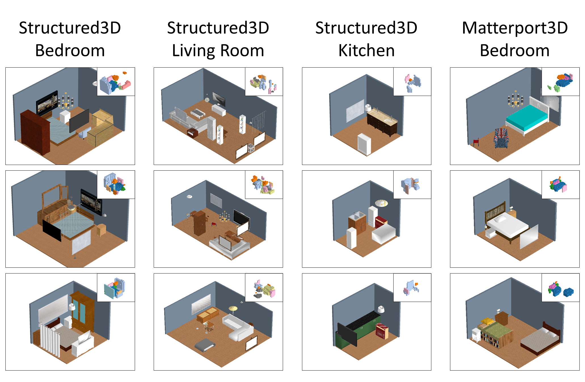

# Indoor Scene Generation From a Collection of Semantic-Segmented Depth Images
This is the code for our paper [Indoor Scene Generation From a Collection of Semantic-Segmented Depth Images](https://arxiv.org/abs/2108.09022).

## Requirements
- cuda 10.1
- python 3.6.8
- Other requirements are list in `requirements.txt`

## Data preparation
We provide the data processing scripts for [Structured3D](https://structured3d-dataset.org/) and [Matterport3D](https://niessner.github.io/Matterport/) dataset.
### 1. Download original dataset
Download [Structured3D](https://structured3d-dataset.org/).
```
├──Structured3D
    ├── Structured3D_bbox.zip
    ├── Structured3D_0.zip
    ├── Structured3D_1.zip
    ├── ...
    ├── Structured3D_17.zip
    ├── Structured3D_perspective_0.zip
    ├── Structured3D_perspective_1.zip
    ├── ...
    ├── Structured3D_perspective_17.zip
```
Download [Matterport3D](https://niessner.github.io/Matterport/).
```
├──Matterport3D/v1/scans
    ├── 1LXtFkjw3qL
    ├── 1pXnuDYAj8r
    ├── ...
```
### 2. Configure the dataset path
Configure `data_dir` and `out_dir` in `examples/scenegen/tools/configs/DataGen-${dataset}-${type}.yaml`, where `dataset` is `Structured3D` or `Matterport3D`, `type` is one of `Bedroom, Living, Kitchen`.

### 3. Generate the training data
Run
```shell script
dataset=Structured3D;  # Structured3D or Matterport3D
type=Bedroom;  # Bedroom, Living or Kitchen

python process.py --task data_gen --cfg_path ./examples/scenegen/tools/configs/DataGen-${dataset}-${type}.yaml
```
The final training data `train_image.records` is stored in `${out_dir}/${label_type}/TrainViewData/`.

## Generative adversarial networks
### 1. Configure the experiment
Configure experiment in `examples/scenegen/configs/Img2vol-${dataset}-${type}.yaml`.

### 2. Train and test
Run
```shell script
measure=Train;  # Train or Test
model_dir=./model_dir/${dataset}_${type}_model
python execute.py --example examples/scenegen --cfg_path ./examples/scenegen/configs/Img2vol-${dataset}-${type}.yaml --data_dir ${out_dir}/${label_type}/TrainViewData/ --model_dir ${model_dir} --log_dir ./log_dir/${dataset}_${type}_log --measure ${measure}
```
to train the model. 
Availabel arguments:
- `--cfg_path`: config file
- `--data_dir`: path of training data
- `--model_dir`: path to save trained model
- `--log_dir`: path to save training log
- `--measure`: Train or Test

### Pre-trained models
The pre-trained models trained on Structured3D (bedroom, living room, kitchen) and Matterport3D (bedroom) dataset.
Dataset | type | Download
---|---|---
Structured3D | bedroom | [ckp-Img2vol-Structured3D-Bedroom.zip](https://github.com/mingjiayang/SGSDI/releases/download/pretrained-model/ckp-Img2vol-Structured3D-Bedroom.zip)
Structured3D | living room | [ckp-Img2vol-Structured3D-Living.zip](https://github.com/mingjiayang/SGSDI/releases/download/pretrained-model/ckp-Img2vol-Structured3D-Living.zip)
Structured3D | kitchen | [ckp-Img2vol-Structured3D-Kitchen.zip](https://github.com/mingjiayang/SGSDI/releases/download/pretrained-model/ckp-Img2vol-Structured3D-Kitchen.zip)
Matterport3D | bedroom | [ckp-Img2vol-Matterport3D-Bedroom.zip](https://github.com/mingjiayang/SGSDI/releases/download/pretrained-model/ckp-Img2vol-Matterport3D-Bedroom.zip)

### Generate scenes
#### Generate semantic scene volume
First set `measure` to `Test`, and then re-run `execute.py` to generate semantic scene volume from random noises. 
The generated scenes data `eval_meta.npz` is stored in `${model_dir}/eval/${training_epoch}`.

#### Visualize the generated semantic scene volume
```shell script
python process.py --task evaluation --cfg_path ./examples/scenegen/tools/configs/DataGen-${dataset}-${type}.yaml --eval_dir ${model_dir}/eval/${training_epoch}/ --output_dir ${model_dir}/eval/${training_epoch}/output/
```
The visualization is saved in `${model_dir}/eval/${training_epoch}/output/vis_3d`.

#### Generate final indoor scenes
To generate the final 3D indoor scene by replacing each volumetric object instance in the volume with a CAD model retrieved from a 3D object database [ShapeNet](https://shapenet.org/) based on their type and volumetric shape.

First download ShapeNetCore v2 data from [ShapeNet](https://shapenet.org/).
Then run
```shell script
shapenet_path=/PathToShapeNet/ShapeNetCore.v2.zip
python process.py --task retrieval --cfg_path ./examples/scenegen/tools/configs/DataGen-${dataset}-${type}.yaml --eval_dir ${model_dir}/eval/${training_epoch}/ --output_dir ${model_dir}/eval/${training_epoch}/output/ --shapenet_path ${shapenet_path}
```
The final generated scenes are saved in `${model_dir}/eval/${training_epoch}/output/retrieval`.

#### Generated example


# Citation
If you find our work useful for your research, please cite us using the bibtex below:
```
@article{yang2021indoor,
  title={Indoor Scene Generation from a Collection of Semantic-Segmented Depth Images},
  author={Yang, Ming-Jia and Guo, Yu-Xiao and Zhou, Bin and Tong, Xin},
  journal={Proceedings of the IEEE/CVF International Conference on Computer Vision (ICCV)},
  year={2021}
}
```
